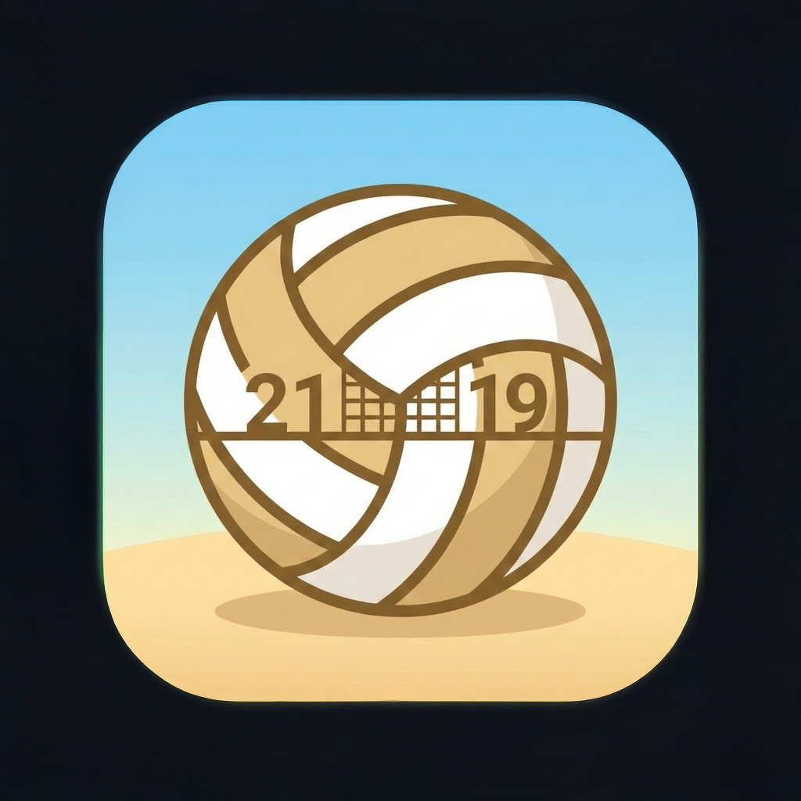

# VolleyballScorer

A React Native mobile app for scoring volleyball matches in real time. Supports multiple match formats, configurable set lengths, serve tracking, timeouts, and match history — all from your phone.

<p align="center">
  
</p>

<p align="center">
  <a href="https://github.com/KArapaj/VolleyballScorer/releases/latest/download/VolleyballScorer_v2.0.apk">
    
  </a>
</p>

## Features

- **Match formats** — Best of 3, Best of 5, or Endless (unlimited sets)
- **Set lengths** — Choose 15, 21, or 25 points per set
- **Live scoring** — Tap to score for either team; scores update instantly
- **Serve tracking** — Coin toss to decide first serve; serve switches automatically on side-outs
- **Timeouts** — 2 timeouts per team per set with a 30-second countdown overlay
- **Undo** — Step back through the last 20 actions
- **Set & match win modals** — Animated celebration on set and match completion
- **Match history** — Results saved locally and viewable from the home screen
- **Resume game** — Auto-saves in progress; continue where you left off after closing the app
- **Landscape support** — Fully responsive layout in both portrait and landscape orientations
- **Screen always-on** — Keeps the display awake during an active match

## Screens

| Screen | Description |
|--------|-------------|
| Home | Start new game, continue saved game, view results |
| Match Format | Choose Best of 3 / Best of 5 / Endless |
| Set Length | Choose 15 / 21 / 25 points |
| Scoring | Live score tracking with full match controls |
| Results | View saved match history |

## Tech Stack

- **React Native** 0.83.1 / React 19
- **React Navigation** (Stack) for screen routing
- **AsyncStorage** for persistent game state and results
- **react-native-sound** for whistle and celebration audio
- **react-native-keep-awake** to prevent screen sleep during a match

## Getting Started

### Prerequisites

- Node.js >= 20
- React Native development environment set up — see the [official guide](https://reactnative.dev/docs/set-up-your-environment)
- Android Studio (for Android) or Xcode (for iOS)

### Install

```sh
git clone https://github.com/KArapaj/VolleyballScorer.git
cd VolleyballScorer
npm install
```

### Run on Android

```sh
# Start Metro bundler
npm start

# In a separate terminal
npm run android
```

### Run on iOS

```sh
bundle install          # first time only
bundle exec pod install # first time or after native dep updates
npm run ios
```

> **Note:** For Android, if the build fails due to a JDK path issue, open `android/gradle.properties` and set `org.gradle.java.home` to your local Android Studio JBR path.

## Project Structure

```
src/
├── components/       # Reusable UI components
│   ├── CoinToss.js
│   ├── ConfirmModal.js
│   ├── MatchWinModal.js
│   ├── ScoreButton.js
│   ├── SetIndicator.js
│   ├── SetWinModal.js
│   ├── TimeoutIndicator.js
│   └── TimeoutOverlay.js
├── constants/
│   └── colors.js     # App color palette
├── screens/
│   ├── HomeScreen.js
│   ├── ResultsScreen.js
│   ├── ScoringScreen.js
│   ├── SetCountScreen.js
│   └── SetLengthScreen.js
└── utils/
    └── SoundManager.js
assets/
└── sounds/
    ├── whistle.mp3
    └── celebration.mp3
```

## License

MIT
